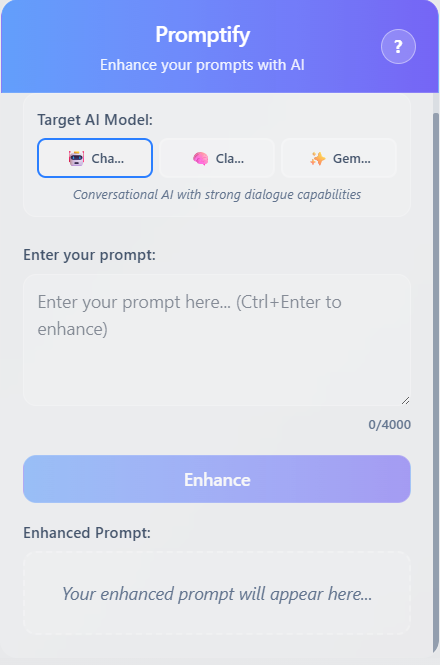

# Promptify - AI-Powered Prompt Enhancement Extension

<div align="center">
  
  
  [](https://opensource.org/licenses/MIT)
  [](https://www.typescriptlang.org/)
  [](https://reactjs.org/)
  [](https://vitejs.dev/)
  [](https://tailwindcss.com/)

  **Professional AI-powered prompt enhancement using Google's Gemini API**
  
  [Features](#features) • [Quick Start](#quick-start) • [Development](#development) • [Contributing](#contributing) • [License](#license)
</div>

---

## About

Promptify is a professional browser extension that enhances prompts using Google's Gemini AI. Designed for content creators, technical writers, and professionals, Promptify transforms basic prompts into detailed, effective instructions through advanced AI assistance.

### Key Features

- **AI-Powered Enhancement**: Leverage Google Gemini's advanced natural language processing
- **Modern Interface**: Clean, intuitive design optimized for productivity
- **High Performance**: Built with Vite and React 19 for optimal speed
- **Multi-Model Support**: Compatible with ChatGPT, Claude, and Gemini workflows
- **Keyboard Navigation**: Complete keyboard shortcuts for efficient operation
- **Responsive Design**: Optimized for various screen sizes and browsers
- **Privacy-Focused**: All API keys stored locally with no data collection

---

## Features

### Core Functionality
- **Intelligent Prompt Enhancement**: Transform basic prompts into detailed, effective instructions
- **Multi-Model Optimization**: Optimize prompts for ChatGPT, Claude, and Gemini
- **Real-time Processing**: Instant AI-powered enhancement with immediate feedback
- **Clipboard Integration**: Seamless copying of enhanced prompts
- **Character Tracking**: Visual indicators for prompt length optimization

### User Experience
- **Keyboard Navigation**: Complete keyboard support for efficient workflow
- **Error Management**: Comprehensive error handling with clear recovery options
- **Loading Indicators**: Real-time visual feedback during processing
- **Integrated Help**: Built-in keyboard shortcuts and usage guide
- **Responsive Interface**: Optimized for browser extension environments

### Technical Implementation
- **TypeScript**: Full type safety and enhanced development experience
- **React 19**: Latest React features with improved performance
- **Tailwind CSS**: Utility-first styling with custom design system
- **Vite Build System**: Fast development and optimized production builds
- **ESLint Integration**: Automated code quality and consistency checks
- **Vitest Testing**: Comprehensive unit and integration test coverage

---

## Quick Start

### Prerequisites

- Node.js 18+ with npm or yarn
- Google Gemini API key ([Get one here](https://makersuite.google.com/app/apikey))
- Chrome or Edge browser for development and testing

### Installation

1. **Clone the repository**
   ```bash
   git clone https://github.com/zahooronly/promptify.git
   cd promptify
   ```

2. **Install dependencies**
   ```bash
   npm install
   ```

3. **Configure environment variables**
   
   Create a `.env` file in the project root:
   ```env
   # Google Gemini API Configuration
   VITE_GEMINI_API_KEY=your_gemini_api_key_here
   
   # Optional: Development Configuration
   VITE_DEV_MODE=true
   VITE_API_TIMEOUT=30000
   ```

   **Security Note**: The `.env` file is excluded from version control. Never commit API keys to the repository.

4. **Build the extension**
   ```bash
   npm run build
   ```

5. **Install in browser**
   - Navigate to `chrome://extensions/` in Chrome or Edge
   - Enable "Developer mode" toggle
   - Click "Load unpacked" and select the generated `build` folder

### Obtaining a Gemini API Key

1. Visit [Google AI Studio](https://makersuite.google.com/app/apikey)
2. Authenticate with your Google account
3. Generate a new API key
4. Copy the key and add it to your `.env` file

The Gemini API provides generous free usage limits suitable for personal and development use.

---

## Development

### Available Scripts

```bash
# Development server with hot reload
npm run dev

# Build for production
npm run build

# Run tests
npm run test

# Run tests with UI
npm run test:ui

# Run tests with coverage
npm run test:coverage

# Lint code
npm run lint

# Preview production build
npm run preview
```

### Project Structure

```
promptify/
├── public/                 # Static assets
│   ├── manifest.json      # Extension manifest
│   └── extension-display-picture.png
├── src/
│   ├── components/        # React components
│   │   ├── PromptInput.tsx
│   │   ├── ModelSelector.tsx
│   │   ├── OutputDisplay.tsx
│   │   ├── HelpTooltip.tsx
│   │   └── ErrorMessage.tsx
│   ├── hooks/            # Custom React hooks
│   │   ├── usePromptEnhancer.ts
│   │   ├── useToast.ts
│   │   └── useKeyboardNavigation.ts
│   ├── services/         # API services
│   │   └── geminiService.ts
│   ├── utils/           # Utility functions
│   │   └── errorUtils.ts
│   ├── types/           # TypeScript definitions
│   ├── App.tsx          # Main application
│   └── main.tsx         # Entry point
├── .env.example         # Environment template
├── vite.config.ts       # Vite configuration
├── tailwind.config.js   # Tailwind configuration
└── package.json
```

### Environment Variables

| Variable | Description | Required | Default |
|----------|-------------|----------|---------|
| `VITE_GEMINI_API_KEY` | Your Google Gemini API key | ✅ Yes | - |
| `VITE_DEV_MODE` | Enable development features | ❌ No | `false` |
| `VITE_API_TIMEOUT` | API request timeout (ms) | ❌ No | `30000` |

### Development Workflow

1. **Start development server**
   ```bash
   npm run dev
   ```

2. **Make your changes**
   - The extension will auto-reload in development mode
   - Check the browser console for any errors

3. **Test your changes**
   ```bash
   npm run test
   ```

4. **Build and test production version**
   ```bash
   npm run build
   # Load the dist folder in your browser
   ```

---

## Contributing

We welcome contributions from developers at all experience levels. Your contributions help improve Promptify for the entire community.

### Ways to Contribute

- **Bug Reports**: Report issues through [GitHub Issues](https://github.com/zahooronly/promptify/issues)
- **Feature Requests**: Propose new features via [GitHub Discussions](https://github.com/zahooronly/promptify/discussions)
- **Code Contributions**: Submit pull requests for bug fixes and new features
- **Documentation**: Improve documentation, guides, and code comments
- **User Interface**: Contribute to UI/UX design improvements
- **Quality Assurance**: Help test new features and identify edge cases

### Contribution Guidelines

#### Getting Started

1. **Review existing issues** to avoid duplicate work
2. **Fork the repository** and create a feature branch
3. **Set up your development environment** following the installation guide

#### Development Process

1. **Create a feature branch**
   ```bash
   git checkout -b feature/your-feature-name
   git checkout -b fix/your-bug-fix
   ```

2. **Follow coding standards**
   - Maintain TypeScript type safety
   - Adhere to existing code patterns and style
   - Include tests for new functionality
   - Update relevant documentation

3. **Commit changes**
   ```bash
   git commit -m "feat: add new prompt enhancement algorithm"
   git commit -m "fix: resolve API timeout issue"
   ```

   We use [Conventional Commits](https://www.conventionalcommits.org/) format:
   - `feat:` - New features
   - `fix:` - Bug fixes
   - `docs:` - Documentation updates
   - `style:` - Code formatting changes
   - `refactor:` - Code restructuring
   - `test:` - Test additions
   - `chore:` - Maintenance tasks

#### Submission Process

1. **Push your branch**
   ```bash
   git push origin feature/your-feature-name
   ```

2. **Create a Pull Request**
   - Provide a clear, descriptive title
   - Explain the changes and their purpose
   - Reference related issues
   - Include screenshots for UI modifications

3. **Code Review**
   - Maintainers will review your submission
   - Address feedback and requested changes
   - Approved changes will be merged into the main branch

### Development Setup for Contributors

1. **Fork and clone the repository**
   ```bash
   git clone https://github.com/zahooronly/promptify.git
   cd promptify
   ```

2. **Install project dependencies**
   ```bash
   npm install
   ```

3. **Configure environment**
   ```bash
   cp .env.example .env
   # Add your Gemini API key to the .env file
   ```

4. **Start development server**
   ```bash
   npm run dev
   ```

### Testing Standards

- Write comprehensive tests for new features and bug fixes
- Ensure all existing tests pass before submitting pull requests
- Include both unit tests and integration tests where applicable
- Test functionality across multiple browsers when possible

### Documentation Requirements

- Update README.md for significant feature changes
- Add JSDoc comments for new functions and components
- Include practical code examples in documentation
- Maintain clear, accessible documentation for all skill levels

### Priority Contribution Areas

We particularly welcome contributions in these areas:

- **AI Model Integrations**: Support for additional AI providers
- **User Interface**: UI/UX enhancements and accessibility improvements
- **Testing Infrastructure**: Expanded test coverage and end-to-end testing
- **Browser Compatibility**: Mobile browser optimization
- **Internationalization**: Multi-language support implementation
- **Performance Optimization**: Bundle size reduction and runtime improvements
- **Security Enhancements**: Advanced security measures and best practices

---

## API Documentation

### Gemini Service Integration

The extension integrates with Google's Gemini API for intelligent prompt enhancement:

```typescript
// Service usage example
import { enhancePrompt } from './services/geminiService';

const enhanced = await enhancePrompt({
  prompt: "Write a blog post about AI",
  model: "gemini-pro",
  targetModel: "ChatGPT"
});
```

### Configuration Interface

```typescript
interface EnhancementOptions {
  prompt: string;           // Original prompt text
  model: string;           // Gemini model identifier
  targetModel: string;     // Target AI model for optimization
  maxTokens?: number;      // Maximum response length
  temperature?: number;    // Response creativity (0-1)
}
```

---

## Troubleshooting

### Common Issues

**Extension not loading?**
- Verify the project has been built (`npm run build`)
- Ensure you're loading the `dist` folder, not the source directory
- Check browser console for error messages

**API errors?**
- Confirm your Gemini API key is correctly configured
- Verify API quota availability
- Ensure proper API key permissions

**Build failures?**
- Clear dependencies and reinstall: `rm -rf node_modules && npm install`
- Verify Node.js version compatibility (requires 18+)
- Check all environment variables are properly configured

**Performance issues?**
- Confirm you're not running in development mode for production use
- Clear browser cache and extension data
- Monitor network requests in browser DevTools

### Getting Support

- Review our [Documentation](https://github.com/zahooronly/promptify/wiki)
- Join [Community Discussions](https://github.com/zahooronly/promptify/discussions)
- [Report Issues](https://github.com/zahooronly/promptify/issues)
- Contact: support@promptify.dev

---

## Deployment

### Production Build

```bash
# Create optimized production build
npm run build

# The extension will be built to the `dist` directory
# Load this directory in your browser's extension manager
```

### Chrome Web Store Publication

1. **Prepare extension package**
   - Test thoroughly across multiple browsers
   - Update version number in `manifest.json`
   - Create promotional materials and store descriptions

2. **Submit to Chrome Web Store**
   - Access [Chrome Web Store Developer Dashboard](https://chrome.google.com/webstore/devconsole/)
   - Upload extension package
   - Complete store listing information
   - Submit for review process

---

## Security & Privacy

### Data Handling

- **API Keys**: Stored locally on user device, never transmitted to external servers
- **User Prompts**: Sent exclusively to Google Gemini API per their privacy policy
- **No Tracking**: No collection of personal or usage data
- **Local Storage**: All application data remains on user device

### Security Measures

- Content Security Policy (CSP) implementation
- Input sanitization and validation protocols
- Secure HTTPS-only API communication
- Regular dependency security updates

---

## License

This project is licensed under the MIT License.

```
MIT License

Copyright (c) 2025 Promptify

Permission is hereby granted, free of charge, to any person obtaining a copy
of this software and associated documentation files (the "Software"), to deal
in the Software without restriction, including without limitation the rights
to use, copy, modify, merge, publish, distribute, sublicense, and/or sell
copies of the Software, and to permit persons to whom the Software is
furnished to do so, subject to the following conditions:

The above copyright notice and this permission notice shall be included in all
copies or substantial portions of the Software.

THE SOFTWARE IS PROVIDED "AS IS", WITHOUT WARRANTY OF ANY KIND, EXPRESS OR
IMPLIED, INCLUDING BUT NOT LIMITED TO THE WARRANTIES OF MERCHANTABILITY,
FITNESS FOR A PARTICULAR PURPOSE AND NONINFRINGEMENT. IN NO EVENT SHALL THE
AUTHORS OR COPYRIGHT HOLDERS BE LIABLE FOR ANY CLAIM, DAMAGES OR OTHER
LIABILITY, WHETHER IN AN ACTION OF CONTRACT, TORT OR OTHERWISE, ARISING FROM,
OUT OF OR IN CONNECTION WITH THE SOFTWARE OR THE USE OR OTHER DEALINGS IN THE
SOFTWARE.
```

---

## Acknowledgments

We extend our gratitude to:

- **Google AI Team** for providing the Gemini API
- **React Development Team** for the robust framework
- **Vite Team** for the efficient build system
- **Tailwind CSS** for the comprehensive utility framework
- **Open Source Community** for continuous inspiration and support

---

## Contact & Support

### Community

- **GitHub Repository**: [zahooronly/promptify](https://github.com/zahooronly/promptify)
- **Issues & Bug Reports**: [GitHub Issues](https://github.com/zahooronly/promptify/issues)
- **Feature Discussions**: [GitHub Discussions](https://github.com/zahooronly/promptify/discussions)

### Project Roadmap

View our development roadmap and upcoming features at [GitHub Projects](https://github.com/zahooronly/promptify/projects).

---

<div align="center">
  <p>Built with precision by the Promptify development team</p>
  <p>
    <a href="https://github.com/zahooronly/promptify">⭐ Star on GitHub</a> •
    <a href="https://github.com/zahooronly/promptify/issues">🐛 Report Issues</a> •
    <a href="https://github.com/zahooronly/promptify/discussions">💡 Request Features</a>
  </p>
</div>